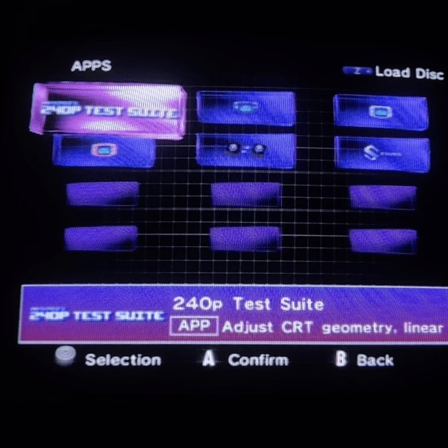

# [GameCube Banner Editor & Converter](https://git2358.github.io/GameCube-Banner-Editor-Converter/)

## A simple web-based GUI for creating and editing GameCube `opening.bnr` files for use with **[cubiboot-new-ui](https://github.com/DarthMotzkus/cubiboot-new-ui)**.

---

🌐 **Web App:**
[GameCube Banner Editor & Converter](https://git2358.github.io/GameCube-Banner-Editor-Converter/)



---

## Contents

- [What is this?](#what-is-this)
- [Included Resources](#included-resources)
  - [`bnr/` — Ready-to-use Banners](#bnr--ready-to-use-banners)
  - [`logos/` — Example Artwork](#logos--example-artwork)
- [Quick Start](#quick-start)
- [TL;DR — Using it with cubiboot-new-ui](#tldr--using-it-with-cubiboot-new-ui)
  - [Example: Swiss](#example-swiss)
- [Creating a Banner](#creating-a-banner)
- [Editing an Existing `.bnr`](#editing-an-existing-bnr)
- [Banner Image Fitting](#banner-image-fitting)
- [Using the Banner with cubiboot-new-ui](#using-the-banner-with-cubiboot-new-ui)
- [Full cubiboot-new-ui Guide](#full-cubiboot-new-ui-guide)
- [Credits](#credits)
- [Demos](https://github.com/git2358/GameCube-Banner-Editor-Converter/tree/main/demo)

---

## What is this?

This is a simple web-based GUI implementation of the `banner-converter` tool included with:

* [DarthMotzkus/cubiboot-new-ui](https://github.com/DarthMotzkus/cubiboot-new-ui)
* [cubiboot-new-ui Banner Converter](https://github.com/DarthMotzkus/cubiboot-new-ui/tree/main/tools/banner-converter)

It allows you to create a GameCube `opening.bnr` file without needing to run Python scripts or install additional software.

You can:

* Create a new `.bnr` file
* Edit an existing `.bnr` file
* Change the title, description and other text
* Replace or update the banner artwork
* Preview how the artwork will appear
* Choose how the image is fitted:

  * `contain`
  * `cover`
  * `stretch`

---

## Included Resources

The repository also includes ready-to-use resources to help you get started.

### `bnr/` — Ready-to-use Banners

The [`bnr`](https://github.com/git2358/GameCube-Banner-Editor-Converter/tree/main/bnr) folder contains **ready-made `.bnr` files** that can be copied directly to your **cubiboot-new-ui apps folders**.

These can be useful if you:

* Want a banner without creating one yourself
* Want to quickly test cubiboot-new-ui banners
* Want examples of finished `.bnr` files
* Want to use an existing banner as a starting point

For example:

```text
sd:/
└── apps/
    └── my-app/
        ├── default.dol
        └── opening.bnr   ← copy a ready-made .bnr from /bnr/
```

You can also load these `.bnr` files into the **GameCube Banner Editor & Converter** if you want to modify the title, description or artwork.

### `logos/` — Example Artwork

The [`logos`](https://github.com/git2358/GameCube-Banner-Editor-Converter/tree/main/logos) folder contains **example logo/artwork files** that can be used when creating banners.

These are provided as examples and can also be useful for experimenting with the different image fitting modes:

* `contain`
* `cover`
* `stretch`

Load an image from the `logos` folder into the editor, preview how it looks in the banner, and then export your own `opening.bnr`.

---

## Quick Start

If you just want to get something working quickly:

1. Open the [`bnr`](https://github.com/git2358/GameCube-Banner-Editor-Converter/tree/main/bnr) folder.
2. Choose a ready-made `.bnr`.
3. Rename it to `opening.bnr` if necessary.
4. Put it alongside your `default.dol`.

```text
sd:/
└── apps/
    └── my-app/
        ├── default.dol
        └── opening.bnr
```

Or, if you want to make your own:

1. Open the [Web App](https://git2358.github.io/GameCube-Banner-Editor-Converter/).
2. Create or edit a banner.
3. Use an example image from [`logos/`](https://github.com/git2358/GameCube-Banner-Editor-Converter/tree/main/logos), or load your own artwork.
4. Export the `.bnr`.
5. Rename it to `opening.bnr`.
6. Place it next to your `default.dol`.

For the full **cubiboot-new-ui** homebrew application requirements, see the [cubiboot-new-ui Homebrew Apps documentation](https://github.com/DarthMotzkus/cubiboot-new-ui/blob/main/docs/settings.md#homebrew-apps).

---

## TL;DR — Using it with cubiboot-new-ui

**cubiboot-new-ui** treats a folder containing both `default.dol` and `opening.bnr` as an **app**. The two files must be in the **same folder**.

For example:

```text
sd:/
└── apps/
    └── my-app/
        ├── default.dol
        └── opening.bnr
```

Where:

* `default.dol` = the `.dol` app that cubiboot-new-ui will launch
* `opening.bnr` = the banner containing the app's title, description and 96×32 banner artwork

cubiboot-new-ui displays the folder as an app using the information and artwork contained in `opening.bnr`. Pressing **A** launches `default.dol`.

### Example: Swiss

Swiss is a special case in **cubiboot-new-ui**. An app folder whose name starts with `swiss` can be recognised and launched directly. Capitalisation does not matter.

For example:

```text
sd:/
└── apps/
    └── swiss_/
        ├── default.dol
        └── opening.bnr
```

Where:

* `default.dol` = your Swiss `.dol`, renamed to `default.dol`
* `opening.bnr` = the banner created with this tool

---

## Creating a Banner

1. Open the [GameCube Banner Editor & Converter](https://git2358.github.io/GameCube-Banner-Editor-Converter/).
2. Choose **New Banner**.
3. Enter your title and description.
4. Load your artwork.
5. Choose how the artwork should fit:

   * **Contain** — keeps the entire image visible.
   * **Cover** — fills the banner area and may crop the image.
   * **Stretch** — stretches the image to fill the banner area.
6. Preview the result.
7. Export the `opening.bnr`.
8. Place it next to your `default.dol`.

The banner artwork in the `opening.bnr` is **96×32 pixels**.

---

## Editing an Existing `.bnr`

You can also load an existing `opening.bnr` and edit it.

This is particularly useful when you only want to:

* Fix or change the title
* Change the description
* Update text
* Make small adjustments to an existing banner

### Important

Loading an existing `.bnr` **does not modify or re-compress the existing banner image**.

This means you can load an existing banner, change the text, and save it without unnecessarily degrading the original artwork.

If you want to change the artwork, simply load a new image. Your existing text will remain available for editing.

---

## Banner Image Fitting

The editor provides three ways to fit an image into the banner area:

| Mode      | Description                                          |
| --------- | ---------------------------------------------------- |
| `contain` | Shows the entire image without cropping.             |
| `cover`   | Fills the banner area and crops as necessary.        |
| `stretch` | Stretches the image to exactly fill the banner area. |

This is useful because your source artwork does not necessarily have to already be the same aspect ratio as the GameCube banner.

---

## Using the Banner with cubiboot-new-ui

A folder containing both `default.dol` and `opening.bnr` is treated by **cubiboot-new-ui** as an app rather than a normal folder.

For example:

```text
/apps/
├── swiss_/
│   ├── default.dol
│   └── opening.bnr
│
├── another-app/
│   ├── default.dol
│   └── opening.bnr
│
└── some-folder/
    └── other-files...
```

A folder missing either `default.dol` or `opening.bnr` continues to behave as a normal folder in **cubiboot-new-ui**.

---

## Full cubiboot-new-ui Guide

For the complete **cubiboot-new-ui** documentation, including homebrew applications and other configuration options, see:

[**cubiboot-new-ui Settings & Documentation — Homebrew Apps**](https://github.com/DarthMotzkus/cubiboot-new-ui/blob/main/docs/settings.md#homebrew-apps)

---

## Credits

This project is a web-based GUI implementation inspired by the banner converter included in:

[DarthMotzkus/cubiboot-new-ui](https://github.com/DarthMotzkus/cubiboot-new-ui)

**cubiboot-new-ui** is a fork of the original Cubiboot project.

Thanks to the **Cubiboot and cubiboot-new-ui projects and its contributors** and for the original Cubiboot banner converter.
